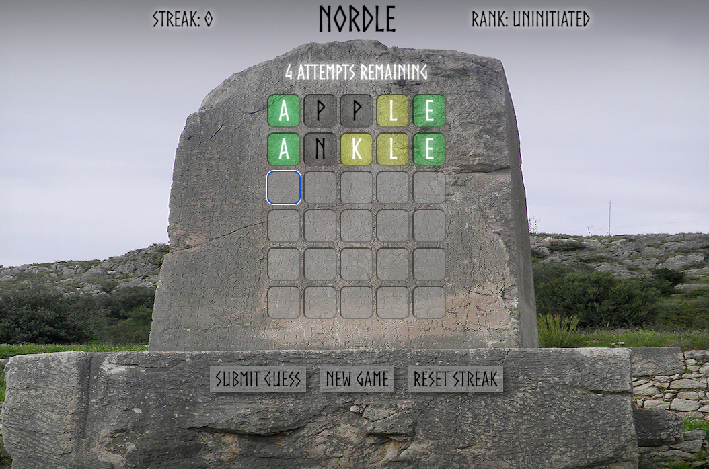

# NORDLE

Nordle is a Wordle re-creation with a Norse mythology-inspired theme. The original game, Wordle, was created by Welsh software engineer Josh Wardle and was originally published in 2021. In 2022, the game was bought by the New York Times Company which now maintains and publishes it. 

The objective of the game is to guess the secret five-letter word within six attempts. To play, simply type out your five-letter guess word. Note that the word must be a valid English word. To submit your guess, either hit the Submit Guess button or press Enter. 

The correctness of your guess will be revealed by the resulting color of each tile/letter. A green tile indicates that the letter is in the secret word and is in the correct position; a yellow tile indicates that the letter is in the word, but is not in the correct position; a black letter indicates either that the letter is not in the word, or that there are no more of that letter in the word. Note that in the game, "letters" are referred to as "runes".  

Each consecutive win will add one to your streak, and will periodically update your Rank based on the traditional Norse hierarchy structure (Learn more about the Norse hierarchy system [here](https://scandinaviafacts.com/viking-ranks-class-systems/)). Try to win 10 games in a row to become a Rune Master!

## [Play the game here](https://nordle-game.netlify.app/)
Check out my initial planning materials [here](https://docs.google.com/document/d/1c42hRy14MzApsnWahGEokt59xeHNBhvgrLpR9Z4fE9A/edit)

## Technologies used 💻
 
- HTML
- CSS
- JavaScript
- Git

## Credits 🙌

- Check out the [Attributions](https://github.com/cmacnamara/wordle-js/blob/main/assets/attributions.md)

## Recent Changes ✏️
- Updated CSS to handle smaller screen sizes

## Ice Box 🧊
- [x] Add functionality to store users' progress toward Rune Master on local machine
- [x] Add responsive CSS rules to handle window resizing
- [ ] Add light/dark mode options
- [ ] Add difficulty selection feature to add/remove number of guesses allowed
- [ ] Make win/loss messages glow with red or green
- [ ] Add sound effects